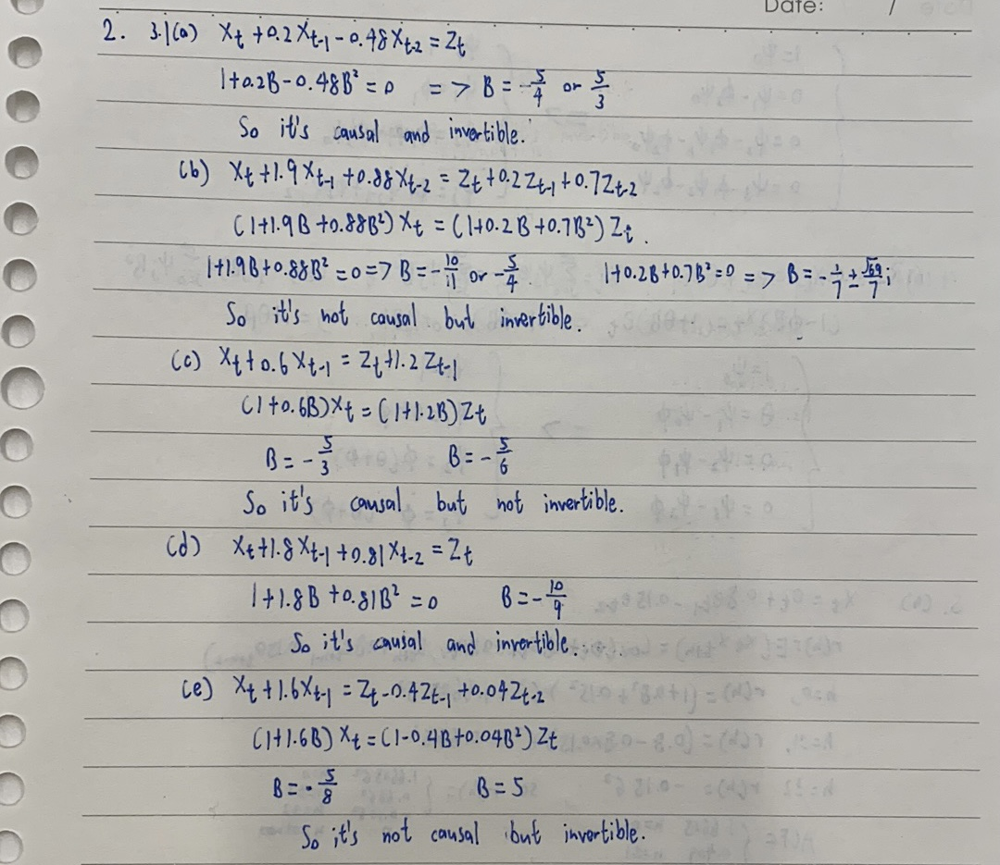
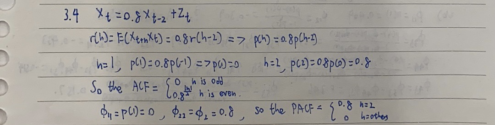
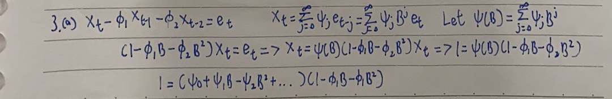
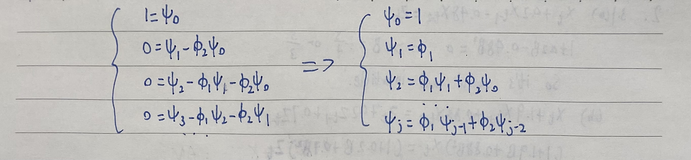
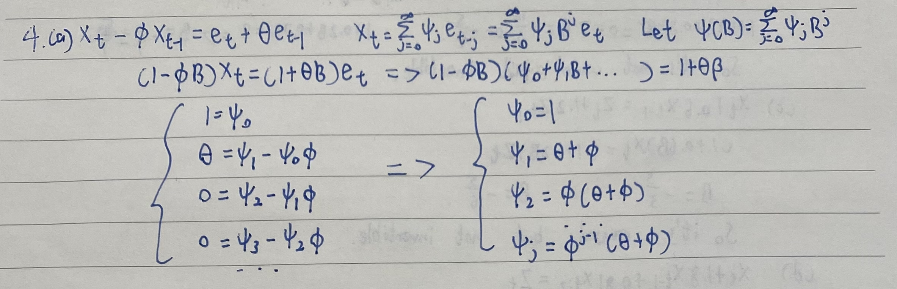
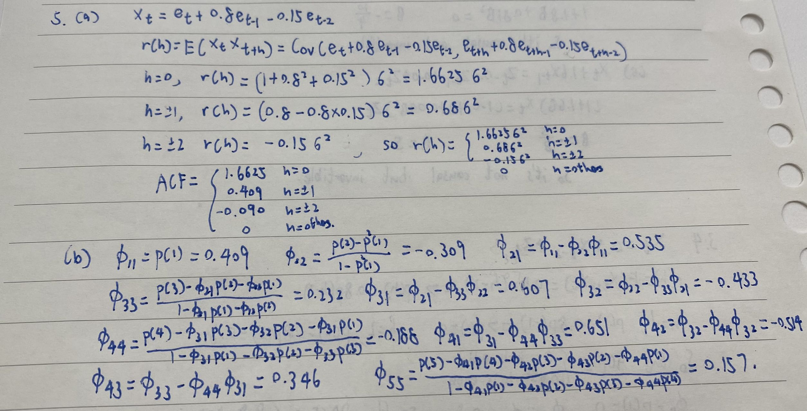

```{r setup, include=FALSE}
knitr::opts_chunk$set(echo = TRUE)
```

# Problem 1

For each of the following scenarios, choose Φ1 and Φ2 so that the resulting AR(2) process is causal. In each case use R to plot ACF and PACF of the AR(2) process and discuss the characteristics of the plots.
(i) Φ1 > 0 and Φ2 > 0
(ii) Φ1 < 0 and Φ2 > 0
(iii) Φ1 > 0 and Φ2 < 0
(iv) Φ1 < 0 and Φ2 < 0

```{r}
par(mfrow=c(2,2))
#1
y = ARMAacf(ar = c(1.1,0.3), lag.max = 20)
y = y[2:21]
plot(y, x = 1:20, type = "h", ylim = c(-1,1), xlab = "h", ylab = "Autocorrelation", main = "AR(2) Population ACF in case 1")
abline(h = 0)
y = ARMAacf(ar = c(1.1, 0.3), lag.max = 20,pacf=T)
plot(y, x = 1:20, type = "h", ylim = c(-1,1), xlab = "h", ylab = "Partial Autocorrelation", main = "AR(2) Population PACF in case 1")
abline(h = 0)
#2
y = ARMAacf(ar = c(-1.1,0.3), lag.max = 20)
y = y[2:21]
plot(y, x = 1:20, type = "h", ylim = c(-1,1), xlab = "h", ylab = "Autocorrelation", main = "AR(2) Population ACF in case 2")
abline(h = 0)
y = ARMAacf(ar = c(-1.1, 0.3), lag.max = 20,pacf=T)
plot(y, x = 1:20, type = "h", ylim = c(-1,1), xlab = "h", ylab = "Partial Autocorrelation", main = "AR(2) Population PACF in case 2")
abline(h = 0)
#3
y = ARMAacf(ar = c(1.1,-0.3), lag.max = 20)
y = y[2:21]
plot(y, x = 1:20, type = "h", ylim = c(-1,1), xlab = "h", ylab = "Autocorrelation", main = "AR(2) Population ACF in case 3")
abline(h = 0)
y = ARMAacf(ar = c(1.1,-0.3), lag.max = 20,pacf=T)
plot(y, x = 1:20, type = "h", ylim = c(-1,1), xlab = "h", ylab = "Partial Autocorrelation", main = "AR(2) Population PACF in case 3")
abline(h = 0)
#4
y = ARMAacf(ar = c(-1.1,-0.3), lag.max = 20)
y = y[2:21]
plot(y, x = 1:20, type = "h", ylim = c(-1,1), xlab = "h", ylab = "Autocorrelation", main = "AR(2) Population ACF in case 4")
abline(h = 0)
y = ARMAacf(ar = c(-1.1, -0.3), lag.max = 20,pacf=T)
plot(y, x = 1:20, type = "h", ylim = c(-1,1), xlab = "h", ylab = "Partial Autocorrelation", main = "AR(2) Population PACF in case 4")
abline(h = 0)
```

A: Two cases the ACF are always positive and the other 2 is half positive and half negative.
There are only two lines in PACF which implies that when h>2, the PACF is 0.

\newpage
# Problem 2

## 3.1

```{r fig1, echo=FALSE, fig.cap="Problem 2 (3.1)", out.width = '100%'}

```

## 3.2

For those processes in Problem 3.1 that are causal and invertible, compute and graph their ACF and PACF using the program R.

```{r}
#Let the maximum lag=10
par(mfrow=c(2,2))
#(a)
ARMAacf(ar=c(-0.2,0.48),lag.max=10)
ARMAacf(ar=c(-0.2,0.48),lag.max=10,pacf=T)
y = ARMAacf(ar = c(-0.2,0.48), lag.max = 10)
y = y[2:11]
plot(y, x = 1:10, type = "h", ylim = c(-1,1), xlab = "h", ylab = "Autocorrelation", main = "ACF graph of (a)")
abline(h = 0)
y = ARMAacf(ar = c(-0.2,0.48), lag.max = 10, pacf = T)
y = y[2:11]
plot(y, x = 1:10, type = "h", ylim = c(-1,1), xlab = "h", ylab = "Partial Autocorrelation", main = "PACF graph of (a)")
abline(h = 0)
#(d)
ARMAacf(ar=c(-1.8,0.81),lag.max=10)
ARMAacf(ar=c(-1.8,0.81),lag.max=10,pacf=T)
y = ARMAacf(ar = c(-1.8,0.81), lag.max = 10)
y = y[2:11]
plot(y, x = 1:10, type = "h", ylim = c(-1,1), xlab = "h", ylab = "Autocorrelation", main = "ACF graph of (d)")
abline(h = 0)
y = ARMAacf(ar = c(-1.8,0.81), lag.max = 10, pacf = T)
y = y[2:11]
plot(y, x = 1:10, type = "h", ylim = c(-1,1), xlab = "h", ylab = "Partial Autocorrelation", main = "PACF graph of (d)")
abline(h = 0)
```

## 3.4

```{r fig2, echo=FALSE, fig.cap="Problem 2 (3.4)", out.width = '100%'}

```

\newpage

# Problem 3

```{r fig3, echo=FALSE, fig.cap="Problem 3(a)", out.width = '100%'}

```

```{r fig4, echo=FALSE, fig.cap="Problem 3(a)", out.width = '100%'}

```

```{r}
#b
ARMAtoMA(c(1.1,0.3),0,5)
#c
ARMAacf(ar=c(1.1,0.3),lag.max=5)
#d
ARMAacf(ar=c(1.1,0.3),lag.max=5,pacf=T)
```

\newpage

# Problem 4


```{r fig5, echo=FALSE, fig.cap="Problem 4(a)", out.width = '100%'}

```

```{r}
#b
ARMAtoMA(0.6,-0.2,5)
```

# Problem 5

```{r fig6, echo=FALSE, fig.cap="Problem 5(a)", out.width = '100%'}

```

```{r}
#b
ARMAacf(ma=c(0.8,-0.15),lag.max=5,pacf=T)
```

# Problem 6

## (a)

A:By looking at the plot, I know that it's a AR(2) model, and according the plot of PACF, Φ22=Φ2=-0.2, so Φ2=-0.2, and Φ11=Φ1/(1-Φ2)=0.75, so Φ1=0.9,and I plot this model and it looks the same.

```{r, warning=F}
par(mfrow=c(1,2))
y = ARMAacf(ar = c(0.9,-0.2), lag.max = 20)
y = y[2:21]
plot(y, x = 1:20, type = "h", ylim = c(-1,1), xlab = "h", ylab = "Autocorrelation", main = "6(a), AR(2)")
abline(h = 0)
y = ARMAacf(ar = c(0.9, -0.2), lag.max = 20,pacf=T)
plot(y, x = 1:20, type = "h", ylim = c(-1,1), xlab = "h", ylab = "Partial Autocorrelation", main = "6(a), AR(2)")
abline(h = 0)
```

## (b)

A:By looking at the plot, I know that it's a MA(1) model, and according the plot of ACF, p(1)=$\theta$/(1+$\theta$^2)=-0.4, so $\theta$=-2or -0.5,,and I plot this model and it looks the same.

```{r, warning=F}
par(mfrow=c(1,2))
y = ARMAacf(ma = -0.5, lag.max = 20)
y = y[2:21]
plot(y, x = 1:20, type = "h", ylim = c(-1,1), xlab = "h", ylab = "Autocorrelation", main = "6(b), MA(1), theta=-0.5")
abline(h = 0)
y = ARMAacf(ma = -0.5, lag.max = 20,pacf=T)
plot(y, x = 1:20, type = "h", ylim = c(-1,1), xlab = "h", ylab = "Partial Autocorrelation", main = "6(b), MA(1), theta=-0.5")
abline(h = 0)
y = ARMAacf(ma = -2, lag.max = 20)
y = y[2:21]
plot(y, x = 1:20, type = "h", ylim = c(-1,1), xlab = "h", ylab = "Autocorrelation", main = "6(b), MA(1), theta=-2")
abline(h = 0)
y = ARMAacf(ma = -2, lag.max = 20,pacf=T)
plot(y, x = 1:20, type = "h", ylim = c(-1,1), xlab = "h", ylab = "Partial Autocorrelation", main = "6(b), MA(1), theta=-2")
abline(h = 0)
```


