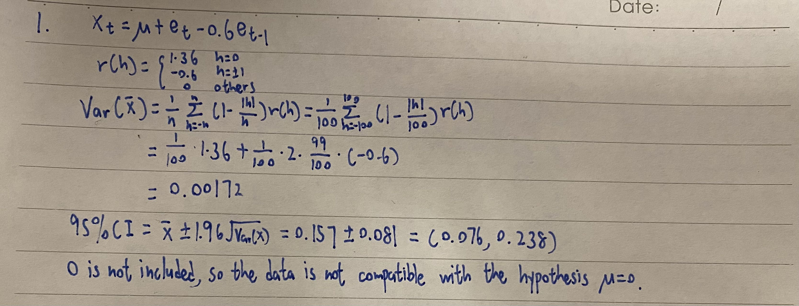
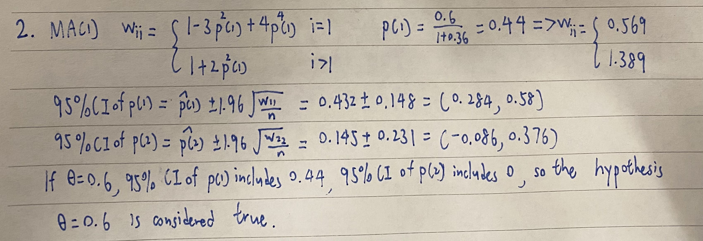

```{r setup, include=FALSE}
knitr::opts_chunk$set(echo = TRUE)
```

# Problem 1

Sample mean $\overline{X}$ = 0.157 was computed from a sample of size 100 generated from a MA(1) process with mean $\mu$ and $\theta$ = 0.6, $\sigma^2$ = 1. Construct an approximate 95% CI for $\mu$. Are the data compatible with the hypothesis that $\mu$ = 0?

```{r fig1, echo=FALSE, fig.cap="Problem 1", out.width = '100%'}

```

\newpage

# Problem 2

Suppose you have a sample of size 100 and obtained $\hat{\rho}$(1) = 0.432 and $\hat{\rho}$(2) = 0.145. Assuming that data was generated from a MA(1) process, construct a 95% CI for $\hat{\rho}$(1) and $\hat{\rho}$(2). Based on these two confidence intervals, is the data consistent with a MA(1) model with $\theta$ = 0.6?

```{r fig2, echo=FALSE, fig.cap="Problem 2", out.width = '100%'}

```

\newpage

# Problem 3

For each one of the following ARMA processes, choose parameters such that the process is causal and invertible. In each case, use the arima.sim function in R to generate a sample realization of size 100. Generate a time series plot of the simulated series, and in each case plot both population and sample ACF and PACF. (i) AR(2) (ii) ARMA(1,1) (iii) MA(1) (iv) ARMA(1,2)

## (i)

```{r}
x=arima.sim(n=100, list(ar=c(-0.2,0.48)))
plot.ts(x)
title(main="AR(2) Process X(t)+0.2X(t-1)-0.48X(t2)=e(t)")
par(mfrow=c(2,2))
y = ARMAacf(ar=c(-0.2,0.48),lag.max = 20)
y = y[2:21]
plot(y, x = 1:20, type = "h", ylim = c(-1,1), xlab = "h",
ylab = "Autocorrelation", main = "AR(2) Population ACF")
abline(h = 0)
y = ARMAacf(ar=c(-0.2,0.48),lag.max = 20,pacf=T)
plot(y, x = 1:20, type = "h", ylim = c(-1,1), xlab = "h",
ylab = "Partial Autocorrelation", main = "AR(2) Population PACF")
abline(h = 0)
acf(x,main="Sample ACF", ylim = c(-1,1))
pacf(x,main="Sample PACF", ylim = c(-1,1))
```

## (ii)

```{r}
x=arima.sim(n=100,list(ar=c(-0.6), ma=c(0.8)))
plot.ts(x)
title(main="ARMA(1,1) Process X(t)+0.6X(t-1)=e(t)+0.8e(t-1)")
par(mfrow=c(2,2))
y = ARMAacf(ar=c(-0.6), ma=c(0.8),lag.max = 20)
y = y[2:21]
plot(y, x = 1:20, type = "h", ylim = c(-1,1), xlab = "h",
ylab = "Autocorrelation", main = "ARMA(1,1) Population ACF")
abline(h = 0)
y = ARMAacf(ar=c(-0.6), ma=c(0.8),lag.max = 20,pacf=T)
plot(y, x = 1:20, type = "h", ylim = c(-1,1), xlab = "h",
ylab = "Partial Autocorrelation", main = "ARMA(1,1) Population PACF")
abline(h = 0)
acf(x,main="Sample ACF", ylim = c(-1,1))
pacf(x,main="Sample PACF", ylim = c(-1,1))
```

## (iii)

```{r}
x=arima.sim(n=100,list(ma=c(0.8)))
plot.ts(x)
title(main="MA(1) Process X(t)=e(t)+0.8e(t-1)")
par(mfrow=c(2,2))
y = ARMAacf(ma=c(0.8),lag.max = 20)
y = y[2:21]
plot(y, x = 1:20, type = "h", ylim = c(-1,1), xlab = "h",
ylab = "Autocorrelation", main = "MA(1) Population ACF")
abline(h = 0)
y = ARMAacf(ma=c(0.8),lag.max = 20,pacf=T)
plot(y, x = 1:20, type = "h", ylim = c(-1,1), xlab = "h",
ylab = "Partial Autocorrelation", main = "MA(1) Population PACF")
abline(h = 0)
acf(x,main="Sample ACF", ylim = c(-1,1), ci.type="ma")
pacf(x,main="Sample PACF", ylim = c(-1,1))
```

## (iv)

```{r}
x=arima.sim(n=100,list(ar=c(-0.6), ma=c(-0.4,0.04)))
plot.ts(x)
title(main="ARMA(1,2) Process X(t)+0.6X(t-1)=e(t)-0.4e(t-1)+0.04e(t-2)")
par(mfrow=c(2,2))
y = ARMAacf(ar=c(-0.6), ma=c(-0.4,0.04),lag.max = 20)
y = y[2:21]
plot(y, x = 1:20, type = "h", ylim = c(-1,1), xlab = "h",
ylab = "Autocorrelation", main = "ARMA(1,2) Population ACF")
abline(h = 0)
y = ARMAacf(ar=c(-0.6), ma=c(-0.4,0.04),lag.max = 20,pacf=T)
plot(y, x = 1:20, type = "h", ylim = c(-1,1), xlab = "h",
ylab = "Partial Autocorrelation", main = "ARMA(1,2) Population PACF")
abline(h = 0)
acf(x,main="Sample ACF", ylim = c(-1,1))
pacf(x,main="Sample PACF", ylim = c(-1,1))
```

\newpage

# Problem 4

The graphs below show the sample ACF and PACF of three time series of length 100 each. On the basis of the available information, choose an ARMA model for the data. You need to identify the order of the model and, if possible, provide approximate values of the ARMA parameters $\phi$ and $\theta$: Justify your answer.

## (a)

A: The PACF plot is significant up to lag 1 and the ACF plot decays to 0, so I think it's an AR(1) plot. According to the given plots, I think the model is X(t)+0.7X(t-1)=e(t).

```{r}
par(mfrow=c(1,2))
x=arima.sim(n=100, list(ar=c(-0.7)))
acf(x,main="Sample ACF", ylim = c(-1,1),xaxp=c(0,20,10))
pacf(x,main="Sample PACF", ylim = c(-1,1),xaxp=c(0,20,10))
```

## (b)

A: The ACF plot is significant up to lag 1 and the PACF plot decays to 0, so I think it's an MA(1) plot. According to the given plots, I think the model is X(t)=e(t)-0.75e(t-1).

```{r}
par(mfrow=c(1,2))
x=arima.sim(n=100, list(ma=c(-0.75)))
acf(x,main="Sample ACF", ylim = c(-1,1),xaxp=c(0,20,10))
pacf(x,main="Sample PACF", ylim = c(-1,1),xaxp=c(0,20,10))
```

## (c)

A: The PACF plot is significant up to lag 2 and the ACF plot decays to 0, so I think it's an AR(2) plot. According to the given plots, I think the model is X(t)-1.4X(t-1)+0.6X(t-2)=e(t).

```{r}
par(mfrow=c(1,2))
x=arima.sim(n=100, list(ar=c(1.4,-0.6)))
acf(x,main="Sample ACF", ylim = c(-1,1),xaxp=c(0,20,10))
pacf(x,main="Sample PACF", ylim = c(-1,1),xaxp=c(0,20,10))
```

## (d)

A: The ACF and PACF plots decay to 0 after lag 1, so I think it's an ARMA(1,1) plot. According to the given plots, I think the model is X(t)-0.3X(t-1)=e(t)-0.65e(t-1).

```{r}
par(mfrow=c(1,2))
x=arima.sim(n=100, list(ar=0.3,ma=-0.65))
acf(x,main="Sample ACF", ylim = c(-1,1),xaxp=c(0,20,10))
pacf(x,main="Sample PACF", ylim = c(-1,1),xaxp=c(0,20,10))
```


\newpage
# Problem 5

For a series of length 169, we find that $\hat{\rho}$(1) = 0.41, $\hat{\rho}$(2) = 0.32, $\hat{\rho}$(3) = 0.26, $\hat{\rho}$(4) = 0.21, and $\hat{\rho}$(5) = 0.16. What ARMA model fits this pattern of auto-correlations? Justify your answer.

A:I think it fits a ARMA(1,1) model, and after some calculation, I think the model is X(t)-0.8X(t-1)=e(t)-0.5e(t-1).

```{r}
ARMAacf(ar=0.8, ma=-0.5,lag.max=5)
x=arima.sim(n=169, list(ar=0.8, ma=-0.5))
acf(x,main="Sample ACF", ylim = c(-1,1),xaxp=c(0,20,10))
```
According to the results, this model seems to fit well.

\newpage
# Problem 6

A stationary time series of length 121 produced sample partial autocorrelation of $\phi_{11}$ = 0.8, $\phi_{22}$ = 0.6, $\phi_{33}$ = 0.08, and $\phi_{44}$ = 0.00. Based on this information alone, what model would we tentatively specify for the series?

A: This PACF is significant up to lag 2, so I think it's an AR(2) model. After some calculation, I think the model is X(t)-0.32X(t-1)-0.6X(t-2)=e(t).

```{r}
ARMAacf(ar=c(0.32,0.6),lag.max=5,pacf=T)
x=arima.sim(n=121, list(ar=c(0.32,0.6)))
pacf(x,main="Sample ACF", ylim = c(-1,1),xaxp=c(0,20,10))
```

According to the results, this model seems to fit well.

\newpage
# Problem 7

Consider the annual sunspots data in R given in data file sunspot.year(yearly numbers of sunspots from 1700 to 1988). If you don't know what sunspots are, check on the internet.
(i) Plot the time series and describe the features of the data.
(ii) Generate a new time series by transforming the data as newsunspot=sqrt(sunspot.year). Plot the new time series. Why is the square-root transformation necessary?
(iii) Plot ACF and PACF of the transformed data. Based on these plots, propose a plausible model and justify your answer.

## (i)

```{r}
plot.ts(sunspot.year)
```

A: The plot seems seasonable and it's mean stationary.

\newpage
## (ii)

```{r}
newsunspot=sqrt(sunspot.year)
plot.ts(newsunspot)
```

A: Square-root transformation makes the data less skew and the variation more uniform.

\newpage
## (iii)

```{r}
acf(newsunspot,ylim = c(-1,1))
pacf(newsunspot,ylim = c(-1,1))
```

Accoring to the plots, I think it's an AR(2) model. X(t)-1.45X(t-1)+0.7X(t-2)=e(t).

```{r}
x=arima.sim(n=100, list(ar=c(1.45,-0.7)))
acf(x,main="Sample ACF", ylim = c(-1,1),xaxp=c(0,20,10))
pacf(x,main="Sample ACF", ylim = c(-1,1),xaxp=c(0,20,10))
```

The plots seems similar, so I think it's a plausible model.