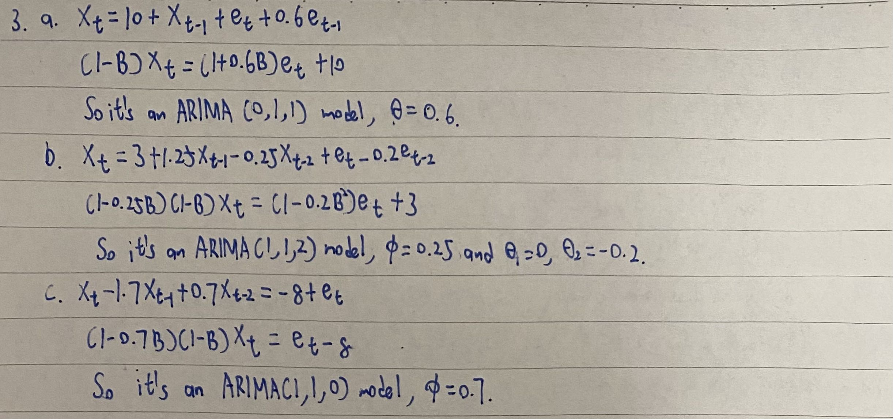
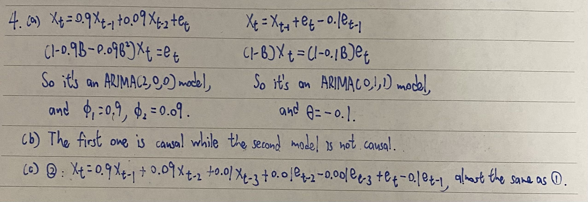
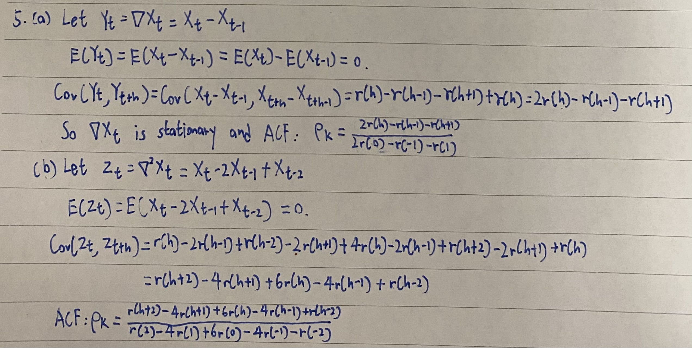
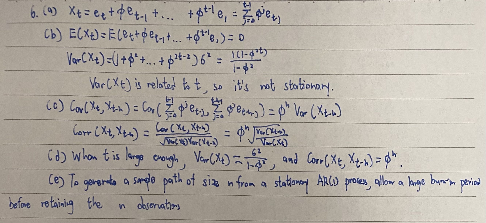

```{r setup, include=FALSE}
knitr::opts_chunk$set(echo = TRUE)
```

# Problem 1

Consider the Johnson and Johnson quarterly earnings data from January 1960 to December 1980 (R data JohnsonJohnson)

a. Plot the data. Describe the features of the data. Do the data look stationary? Explain your answer.

b. Apply an appropriate variance stabilizing transformation, if necessary.

c. Carry out classical decomposition of the data, plot the transformed series along with the ACF and PACF.

d. Identify an ARMA model for the transformed data.

e. Repeat c and d, but instead of classical decomposition, use differencing to make the data stationary.

## (a)

```{r}
plot.ts(JohnsonJohnson,main="Quarterly earnings of JohnsonJohnson",ylab="Earnings")
```

The plot has a increasing trend, so I think it's not stationary.

## (b)

Since the data is not stationary, it's necessary to apply an appropriate variance stabilizing transformation, I use log transformation here.

```{r}
log_JohnsonJohnson <- log(JohnsonJohnson)
plot.ts(log_JohnsonJohnson)
```

## (c)

```{r}
par(mfrow=c(2,2))
plot.ts(JohnsonJohnson,main="JohnsonJohnson Data")
plot.ts(log_JohnsonJohnson, main="JohnsonJohnson Data after log Transformation") 
acf(log_JohnsonJohnson,main="Series log(JohnsonJohnson)")
pacf(log_JohnsonJohnson,main="Series log(JohnsonJohnson)")
```

ACF decays to zero very slowly and pacf is close to 1 at lag 1.


## (d)


It's hard to judge the ARMA model by only the ACF and PACF plot, so I decide to check the model in R.

```{r}
x <- decompose(log_JohnsonJohnson)$random 
x <- x[!is.na(x)] 
bestAICC <- Inf
best_pq <- c(0,0)
for(p in 0:4){
  for(q in 0:4){
    tempAICC <- arima(x, order=c(p,0,q), include.mean=F)$aic
    if(tempAICC < bestAICC){
      bestAICC <- tempAICC
      best_pq <- c(p,q)
    }
  }
}
print(paste0('The best AICC value of ', bestAICC, ' occurs for an ARMA(',best_pq[1],',',best_pq[2],') model.'))
```

So I guess it's an ARMA(4,1) model.

## (e)

```{r}
par(mfrow=c(2,2)) 
plot(log_JohnsonJohnson,main="log JohnsonJohnson Data") 
plot(ts(diff(diff(log(AirPassengers)),lag=12),frequency=12,start=c(1960,1)), 
        ylab="diff(1,12)",main="Differenced Data at lag=(1,12)") 
acf(diff(diff(log_JohnsonJohnson)),main="Series diff(log(JohnsonJohnson))")
pacf(diff(diff(log_JohnsonJohnson)),main="Series diff(log(JohnsonJohnson))")
```

According to the plots, I guess it's an AR(3) model.

\newpage

# Problem 2 

Consider the time series of the numbers of users connected to the Internet through a server every minute (R data WWWusage). Carry out a test for unit root. Apply necessary transformation and identify plausible ARMA models.

```{r}
library(tseries)
adf.test(WWWusage)
```

So we can't reject the null hypothesis, which means that the time series has a unit root, so we need to provide some transformation.

```{r}
adf.test(diff(WWWusage))
```

So differencing for only one time is not enough, so I difference 2 times.

```{r warning=F}
diff_diff_WWWusage <- diff(diff(WWWusage))
adf.test(diff_diff_WWWusage)
acf(diff_diff_WWWusage)
pacf(diff_diff_WWWusage)
```

Now we can reject the null hypothesis and the time series does't have a unit root now.

\newpage

# Problem 3

Identify each of the models below as ARIMA(p, d, q). Specify the order of the models (p, d, q) and the model parameters $\phi$ and $\theta$:

$a. X_t = 10 + X_{t-1} + e_t + 0.6e_{t-1}$

$b. X_t = 3 + 1:25X_{t-1} - 0:25X_{t-2} + e_{t} - 0.2e_{t-2}$

$c. X_t = 1.7X_{t-1} + 0.7X_{t}$

```{r fig1, echo=FALSE, fig.cap="Problem 3", out.width = '100%'}

```

\newpage

# Problem 4

Consider the two models $X_t = 0.9X_{t-1} + 0.09X_{t-2} + e_t$ and $X_t = X_{t-1} + e_t - 0.1e_{t-1}$

a. Identify both models as ARIMA(p, d, q). Specify (p, d, q) and ARMA parameters $\phi$ and $\theta$.

b. In what way the two models are different?

c. In what way the two models are similar? What does this tell you about model selection for time series data?

```{r fig2, echo=FALSE, fig.cap="Problem 4", out.width = '100%'}

```

\newpage

# Problem 5

Let $X_t$ be a stationary process with autocovariance function $(h)$:
a. Show that the process $\nabla X_t$ is stationary and find its autocovariance function.
b. Show that the process $\nabla^2 X_t$ is also stationary.

```{r fig3, echo=FALSE, fig.cap="Problem 5", out.width = '100%'}

```

# Problem 6

Let et be zero mean Gaussian white noise process with variance $\sigma^2$ and let $|\phi|$ < 1 be a constant. Consider the process, starting at $X_1$, $X_1=e_1$, $X_t=\phi X_{t-1}+e_t, t=2,3,...$

a. Express $X_t$ as a linear combination of the white noise process $e_t$.

b. Use the result in (a) to compute the mean and the variance of the process
$X_t$. Is the process $X_t$ stationary?


c. Show $Correlation(X_t,X_{t-h})=\phi^h [\frac{Var(X_{t-h})}{Var({X_t})}]^\frac{1}{2}$ for $h\geq0$

d. Argue that for large t, $Var(X_t)\approx\frac{\sigma^2}{1-\phi^2}$ and $Correlation(X_t,X_{t-h})\approx\phi^h, h\geq0$, so in a sense, $X_t$ is "asymptotically stationary."

e. This result can be used to simulate observations from a stationary Gaussian AR(1) model. Explain how this can be done.

f. Write a R code generate a random sample of size 500 from the AR(1) process
with $\phi$ = 0.6 and $\sigma^2$ = 0.8. Plot the simulated series along with the sample ACF and PACF of the series. Is the sample ACF and PACF consistent with AR(1)?


```{r fig4, echo=FALSE, fig.cap="Problem 6", out.width = '100%'}

```


## (f)

```{r}
set.seed(123) # for reproducibility
n <- 500
phi <- 0.6
sigma2 <- 0.8
ar1_sample <- arima.sim(model = list(ar = phi), n = n, sd = sqrt(sigma2))
plot(ar1_sample, type = "l", main = "Simulated AR(1) Series")
acf(ar1_sample, main = "Sample ACF")
pacf(ar1_sample, main = "Sample PACF")
```

According to the sample ACF and PACF plot, ACF decays to 0 while PACF is significant at lag 1, so it's consistent with AR(1).
