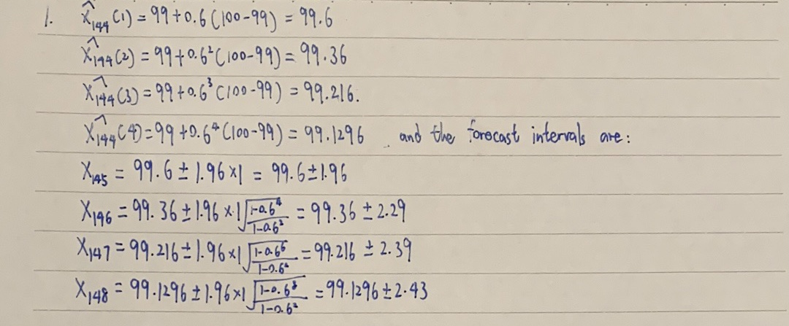
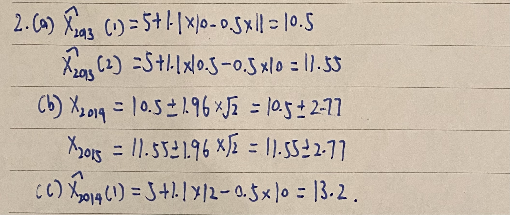

```{r setup, include=FALSE}
knitr::opts_chunk$set(echo = TRUE)
```

# Problem 1

Suppose an AR(1) is fitted to a time series data of length $n$ = 144 and the estimated values of the parameters are $\mu$ = 99, $\phi$ = 0:6 and $\sigma$ = 1. Assume the last three values of the time series are $X_{144} = 100$, $X_{143} = 100$, $X_{142} = 99$. Compute the forecasts and 95% forecast intervals for the next four values. 

```{r fig1, echo=FALSE, fig.cap="Problem 1", out.width = '100%'}

```

\newpage
# Problem 2

Suppose the annual sales of a company (in millions of \$) follow an AR(2) model given by $X_{t}=5+1.1X_{t-1}-0.5X_{t-2}+e_{t}$ with $\sigma^2=2$.

(a) If the sales of the company in 2011, 2012 and 2013 were \$9 million, \$11 million
and \$10 million respectively, forecast sales for 2014 and 2015.

(b) Construct 95% forecast intervals for 2014 and 2015.

(c) If the sales in 2014 turns out to be \$12 million, update your forecast for 2015.

```{r fig2, echo=FALSE, fig.cap="Problem 2", out.width = '100%'}

```

\newpage
# Problem 3

Simulate an AR(2) process with $\phi_1$ = 1.5, $\phi_2$ = -0.75, and $\mu$ = 100. Simulate 100 values, but set aside the last 10 values to compare forecasts to actual values.

(a) Using the first 90 observations in the series, find the MLE of the model parameters. Are the estimates comparable to the true values?

(b) Use the fitted model to forecast the 10 future values and obtain 95% forecast intervals.

(c) What percentage of the observed values are covered by the forecast intervals?

(d) Simulate a new sample data of the same size from the sample model and repeat steps (a),(b) and (c).

## (a)

```{r}
set.seed(1)
phi1 <- 1.5
phi2 <- -0.75
mu <- 100
n <- 100
pro3 <- arima.sim(model=list(ar=c(phi1, phi2)), n=n, mean=mu)
fit <- arima(pro3[1:90], order=c(2,0,0))
estimates <- coef(fit)
estimates
```

According to the results, the estimates are comparable to the true values.

## (b)

```{r}
library(forecast)
pred <- predict(fit, n.ahead=10, interval="95%")
forecast_mean <- pred$pred
forecast_upper <- pred$pred + 1.96*pred$se
forecast_lower <- pred$pred - 1.96*pred$se
forecast(fit,level=c(0.95))
```

## (c)

```{r}
actual <- pro3[91:100]
coverage <- sum(actual > forecast_lower & actual < forecast_upper)/length(actual)*100
coverage
```

So it's 100% covered by the forecast intervals.

## (d)

```{r}
#a
set.seed(1)
phi1 <- 1.5
phi2 <- -0.6
mu <- 100
n <- 100
pro3 <- arima.sim(model=list(ar=c(phi1, phi2)), n=n, mean=mu)
fit <- arima(pro3[1:90], order=c(2,0,0))
estimates <- coef(fit)
estimates
#b
library(forecast)
pred <- predict(fit, n.ahead=10, interval="95%")
forecast_mean <- pred$pred
forecast_upper <- pred$pred + 1.96*pred$se
forecast_lower <- pred$pred - 1.96*pred$se
forecast(fit,level=c(0.95))
#c
actual <- pro3[91:100]
coverage <- sum(actual > forecast_lower & actual < forecast_upper)/length(actual)*100
coverage
```

I changed the two $\phi$s and still fit an AR(2) model, the result is showed as above.

\newpage

# Problem 4

Consider a MA(1) process given by $\mu$ = 5, $\theta$ = 0.6 and $\sigma$ = 0.1. Suppose a sample realization of n = 5 is given by (starting from 1 ending at 5) 4.16, 5.76, 5.77, 4.02, 3.67. Find the forecast of the sixth and seventh observations and construct 95% forecast
intervals.

```{r}
mu <- 5
theta <- 0.6
sigma <- 0.1
n <- 5
x <- c(4.16,5.76,5.77,4.02,3.67)
fit <- arima(x, order=c(0,0,1))
forecast(fit,h=2,level=c(0.95))
```

# Problem 5

Consider the Johnson and Johnson Data from the last homework.

(a) Carry out appropriate Holt-Winters forecast for the next eight values. List and plot the forecasts along with the forecast intervals.

(b) Identify an appropriate ARIMA model and use the model to forecast for the next eight values. List and plot the forecasts along with the forecast intervals.

(c) Set aside the last eight observations in the data set as the validations sample and using the remaining data as the training sample, predict the eight observations. Compute RMSE, MAE and MAPE criteria of forecast comparison. What is your conclusion?

## (a)
```{r}
data("JohnsonJohnson")
library(forecast)
fit <- HoltWinters(JohnsonJohnson,gamma=F)
forecast.hw <- forecast(fit,h=8)
forecast.hw
plot(forecast.hw,main="HW Forecast for JohnsonJohnson")
```

## (b)

```{r}
fit.arima <- auto.arima(JohnsonJohnson)
forecast.arima <- forecast(fit.arima, h = 8)
plot(forecast.arima, main = "ARIMA Forecast for JohnsonJohnson")
```

## (c)

```{r}
validation <- tail(JohnsonJohnson, 8)
training <- head(JohnsonJohnson, -8)
fit.hw.training <- hw(training)
forecast.hw.training <- forecast(fit.hw.training, h = 8)
fit.arima.training <- auto.arima(training)
forecast.arima.training <- forecast(fit.arima.training, h = 8)
rmse.hw <- sqrt(mean((forecast.hw.training$mean - validation)^2))
mae.hw <- mean(abs(forecast.hw.training$mean - validation))
mape.hw <- mean(abs((forecast.hw.training$mean - validation)/validation)) * 100
rmse.arima <- sqrt(mean((forecast.arima.training$mean - validation)^2))
mae.arima <- mean(abs(forecast.arima.training$mean - validation))
mape.arima <- mean(abs((forecast.arima.training$mean - validation)/validation)) * 100
cbind(rmse.hw,mae.hw,mape.hw,rmse.arima,mae.arima,mape.arima)
```

As the result showed, the ARIMA model has lower values of RMSE,MAE and MAPE.

