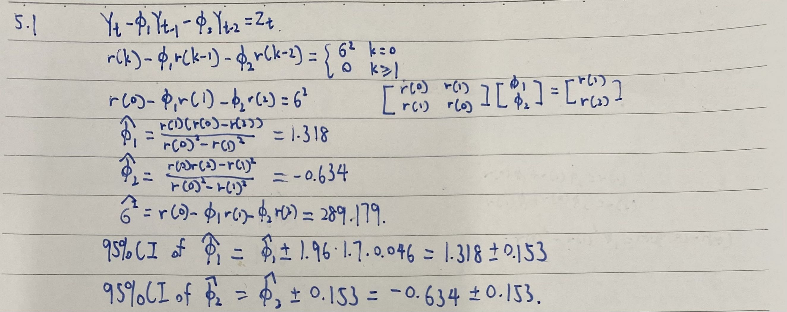
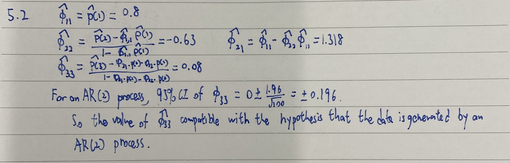
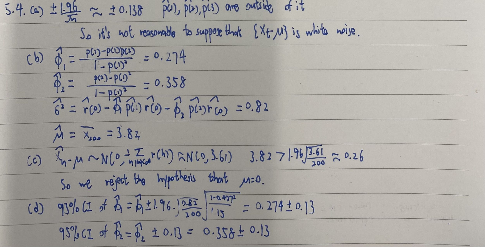
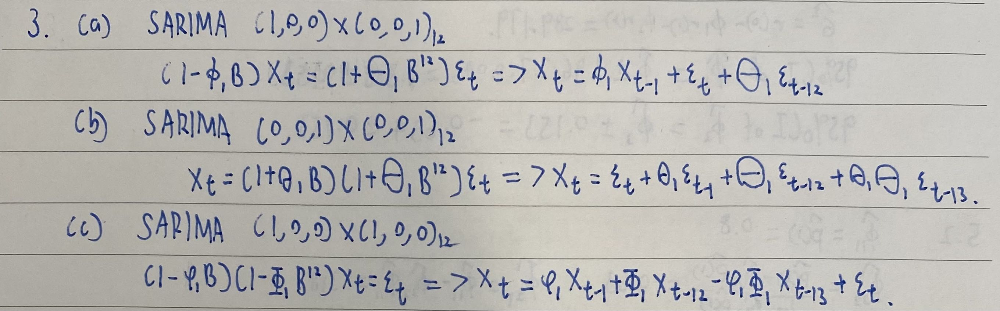

```{r setup, include=FALSE}
knitr::opts_chunk$set(echo = TRUE)
```

# Problem 1

Do the following problems: 5.1, 5.2, 5.4

## 5.1

The sunspot numbers {$X_t$,$t$ = 1,..., 100}, filed as SUNSPOTS.TSM, have sample autocovariances $\hat{\gamma}(0) = 1382.2$, $\hat{\gamma}(1) = 1114.4$, $\hat{\gamma}(2) = 591.734$, and $\hat{\gamma}(3) = 96.216$. Use these values to find the Yule--Walker estimates of $\phi_1$, $\phi_2$, and $\sigma^2$ in the model $Y_t = \phi_1Y_{t−1} + \phi_2Y_{t−2} + Z_t, {Z_t} ∼ WN(0,\sigma^2)$, for the mean-corrected series $Y_t = X_t − 46.93,t = 1,..., 100$. Assuming that the data really are a realization of an AR(2) process, find 95 % confidence intervals for $\phi_1$ and $\phi_2$.


```{r fig1, echo=FALSE, fig.cap="Problem 1 5.1", out.width = '100%'}

```

## 5.2 

From the information given in the previous problem, use the Durbin–Levinson algorithm to compute the sample partial autocorrelations $\hat\phi_{11}$, $\hat\phi_{22}$ and $\hat\phi_{33}$ of the
sunspot series. Is the value of $\hat\phi_{33}$ compatible with the hypothesis that the data
are generated by an AR(2) process? (Use significance level 0.05.)

```{r fig2, echo=FALSE, fig.cap="Problem 1 5.2", out.width = '100%'}

```

## 5.4

Two hundred observations of a time series, $X_1,...,X_{200}$, gave the following sample statistics:

sample mean: $\overline X_{200} = 3.82$;

sample variance: $\hat{\gamma}(0) = 1.15$;

sample ACF: $\hat{\rho}(1) = 0.427$; $\hat{\rho}(2) = 0.475$; $\hat{\rho}(3) = 0.169$

a. Based on these sample statistics, is it reasonable to suppose that $X_t-\mu$ is white noise?

b. Assuming that $X_t-\mu$ can be modeled as the AR(2) process
$X_t − \mu − \phi1(X_{t−1} − \mu) − \phi_2(X_{t−2} − \mu) = Z_t$,
where $Z_t ∼ IID(0,\sigma^2)$, find estimates of $\mu,\phi1,\phi2$ and $\sigma^2$.

c. Would you conclude that $\mu=0$?

d. Construct 95 % confidence intervals for $\phi1$ and $\phi2$.

e. Assuming that the data were generated from an AR(2) model, derive estimates of the PACF for all lags $h\geq1$.

```{r fig3, echo=FALSE, fig.cap="Problem 1 5.4", out.width = '100%'}

```

\newpage
# Problem 2

Derive the ACF of a SARIMA $(0,0,0)\times(1,0,0)_{12}$ model.

```{r fig4, echo=FALSE, fig.cap="Problem 2", out.width = '100%'}

```

\newpage
# Problem 3

For the following SARIMA models, write the models in their standard forms, and find the ACF and PACF using R (choose your own parameters). Describe the ACF and PACF behavior in words.
a. SARIMA$(1,0,0)\times(0,0,1)_{12}$
b. SARIMA$(0,0,1)\times(0,0,1)_{12}$
c. SARIMA$(1,0,0)\times(1,0,0)_{12}$

```{r fig5, echo=FALSE, fig.cap="Problem 3", out.width = '100%'}

```

## (a)

```{r}
library(forecast)
set.seed(123)
data <- ts(rnorm(120), frequency = 12, start = c(2010, 1))
model <- arima(data, order = c(1,0,0), seasonal = list(order = c(0,0,1), period = 12))
tsdisplay(residuals(model), lag.max = 36)
```

## (b)

```{r}
set.seed(123)
data <- ts(rnorm(120), frequency = 12, start = c(2010, 1))
model <- arima(data, order = c(0,0,1), seasonal = list(order = c(0,0,1), period = 12))
tsdisplay(residuals(model), lag.max = 36)
```

## (c)

```{r}
set.seed(123)
data <- ts(rnorm(120), frequency = 12, start = c(2010, 1))
model <- arima(data, order = c(1,0,0), seasonal = list(order = c(1,0,0), period = 12))
tsdisplay(residuals(model), lag.max = 36)
```

\newpage
# Problem 4

Consider the co2 data in the dataset pacakage in R, which is Mauna Loa atmospheric CO2 Concentration. Set aside the last 24 observations as the test data and the rest as the training data.

a. Plot the data and apply Box-Cox transformation, if necessary.

b. Forecast 1: Use subset selection method to fit an ARIMA model to the data. Verify if the model is adequate. Forecast the 24 values along with the forecast intervals.

Forecast 2: Now identify potential SARIMA models for ACF and PACF plots. Fit the candidate models and compare AICC to choose your final model. Use the model to Forecast the 24 values along with the forecast intervals.

Forecast 3: Use Holt-Winters seasonal forecasting method to predict the 24 values along with the forecast intervals.

c. Now complete the following table to compare between the forecasts:
\begin{tabular}{|l|c|c|c|}
\hline Criteria&Forecast 1&Forecast 2&Forecast 3\\
\hline RMSE (Root Mean Squared Error)& & & \\
\hline MAPE (Mean Average Percent Error)& & & \\
\hline
\end{tabular}
What is your conclusion?

## (a)

```{r}
data(co2)
train <- window(co2, end = c(1995, 12))
test <- window(co2, start = c(1996, 1))
plot(co2, main = "Mauna Loa Atmospheric CO2 Concentration", ylab = "CO2 Concentration")
lambda <- BoxCox.lambda(co2)
co2_bc <- BoxCox(co2,lambda=lambda)
plot(co2_bc, main = "Transformed Mauna Loa Atmospheric CO2 Concentration", ylab = "Transformed CO2 Concentration")
```

## (b)

### Forecast 1

```{r}
fit <- auto.arima(train)
summary(fit)
checkresiduals(fit)
forecast1 <- forecast(fit, h = 24)
forecast1
```

### Forecast 2

```{r}
library(tidyverse)
library(MuMIn)
ggtsdisplay(train)
fit1 <- Arima(train, order = c(0,1,1), seasonal = list(order = c(0,1,1), period = 12))
fit2 <- Arima(train, order = c(0,1,1), seasonal = list(order = c(1,1,1), period = 12))
fit3 <- Arima(train, order = c(1,1,1), seasonal = list(order = c(0,1,1), period = 12))
fit4 <- Arima(train, order = c(1,1,1), seasonal = list(order = c(1,1,1), period = 12))
AICc(fit1, fit2, fit3, fit4)
final_fit <- fit1
forecast2 <- forecast(final_fit, h = 24)
forecast2
```

### Forecast3

```{r warning=F}
fit <- HoltWinters(train, seasonal = "multiplicative")
forecast3 <- forecast(fit, h = 24)
forecast3
```

## (c)

```{r}
m1 <- forecast1$mean
m2 <- forecast2$mean
m3 <- forecast3$mean
rmse_1 <- sqrt(mean((test - m1)^2))
mape_1 <- mean(abs(test-m1)/test) * 100
rmse_2 <- sqrt(mean((test - m2)^2))
mape_2 <- mean(abs(test-m2)/test) * 100
rmse_3 <- sqrt(mean((test - m3)^2))
mape_3 <- mean(abs(test-m3)/test) * 100
```

So the table should look like this

\begin{tabular}{|l|c|c|c|}
\hline Criteria&Forecast 1&Forecast 2&Forecast 3\\
\hline RMSE (Root Mean Squared Error)&0.354169&0.354071&0.351115\\
\hline MAPE (Mean Average Percent Error)&0.07581&0.07614&0.07550\\
\hline
\end{tabular}

In conclusion, these 3 methods have similar RMSE and MAPE, and Forecast 3 using the Holt-Winters method has slightly lower RMSE and MAPE, so it's the most accurate forecast among the three.

# Problem 5

Suppose $X_t$ satisfies an AR(1) model with parameter $\phi$. How long a series do you need to estimate $\phi$ so that with 95% confidence the estimation error within $\pm0.1$ of the true value?

```{r fig6, echo=FALSE, fig.cap="Problem 5", out.width = '100%'}

```


